<div align="center">
  
</div>
<div align="center">

[](https://www.linkedin.com/in/vaishnav-venkatesh-76b529319/)
[](https://github.com/Vaishnav0777)
[](https://github.com/Vaishnav0777)

</div>

---

### 🧠 About Me

I'm an undergraduate student who sits at the intersection of **technology and product thinking**. I don't just build things — I think about *why* they should exist, *who* they're for, and *how* they create value.

- 🔭 Currently building **AI-powered products** that solve real-world problems
- 🧩 Passionate about **product management** — user research, roadmaps, prioritization, and shipping things that matter
- 🤖 Deep interest in **AI/ML, Deep Learning, and Computer Vision**
- 📊 I love turning messy problems into clean, user-centric solutions
- ⚡ My superpower: bridging the gap between **what's technically possible** and **what users actually need**

---

### 🎯 How I Think

```
💡 Spot a problem → 🔍 Research users → 📐 Design a solution → 💻 Build it → 📈 Measure impact → 🔄 Iterate
```

I approach every project with a **product mindset** — starting from the user's pain point, not the technology. Whether it's training a model or designing an interface, I ask: *does this make someone's life better?*

---

### 🛠️ Tech Stack

<div align="center">

**Languages**


**AI / ML**


**Product & Design**


**Web & Tools**


</div>

---

### 🚀 Featured Projects

| Project | What it does | Why I built it | Tech |
|---------|-------------|----------------|------|
| [🤖 SmartStock-Agents](https://github.com/Vaishnav0777/SmartStock-Agents) | AI agents that analyze stock market data | Wanted to explore how autonomous agents can assist in financial decision-making | TypeScript |
| [🧏 AI Sign Language Translator](https://github.com/Vaishnav0777/AI-Sign-Language-Translator-With-learning-mode) | Real-time sign language recognition with a learning mode | Making communication more accessible for the hearing-impaired community | Python, Jupyter |
| [🎬 Movie Ticket Booking](https://github.com/Vaishnav0777/online-movie-ticket-booking-system) | End-to-end movie booking platform | Explored full product lifecycle — from user flows to booking confirmation | TypeScript |
| [☁️ Artifex Creator Cloud](https://github.com/Vaishnav0777/artifex-creator-cloud) | Cloud-based creative content generation tool | Built for creators who need AI-assisted content at scale | TypeScript |
| [🧠 MindMesh Creator](https://github.com/Vaishnav0777/mindmesh-creator) | Interactive mind mapping and brainstorming tool | Solving the "blank page" problem for product ideation sessions | TypeScript |
| [⚡ FlashBrainBooster](https://github.com/Vaishnav0777/flashbrainbooster) | Smart flashcard app with spaced repetition | Learning science meets product design — optimizing how people retain knowledge | TypeScript |

---

### 📚 What I'm Learning

🔹 How to write better **PRDs** (Product Requirement Documents)  
🔹 **User research methods** — interviews, surveys, and behavioral analytics  
🔹 Advanced **Deep Learning** — transformers, diffusion models, and reinforcement learning  
🔹 **System design** — building products that scale  

---

### 📊 GitHub Stats

<div align="center">


</div>

<div align="center">


</div>

---

### 🐍 Contribution Graph

<div align="center">


</div>

---

<div align="center">

### 🤝 Let's Connect!

💬 *I love talking about product ideas, AI experiments, and building things that matter.*

*Whether you're a recruiter, a fellow builder, or someone with a cool idea — let's chat!*

</div>

